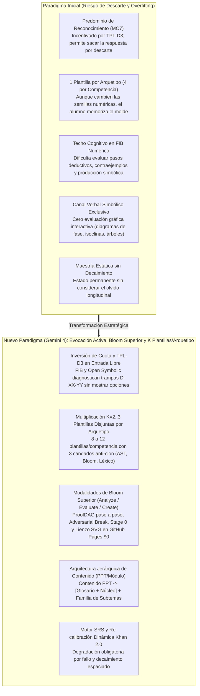

# Hoja de Ruta Maestra de Evolución y Milestones: Tops Academy
## Elevando la Vara: Certificación Formal Multi-Agente Neuro-Simbólica (Lean 4), Transición hacia Evocación Activa (Bloom Superior), Multiplicación Anti-Overfitting con Gemini 4 y "Antigravity Study Harness"

> **Documento Estratégico y Hoja de Ruta Ejecutiva de Ingeniería**  
> **Fecha de Actualización:** 2026-11-21 (Branch: `milestone_20` / `main` — Arquitectura de 4 Ejes, Reforma `TPL-D3` Anti-Descarte, Milestone 20 Core + 20-B Modo Hierro cerrados, **`k = 2` (`DEFAULT_TEMPLATES_PER_MODALITY = 2`) consolidado como estándar estable de producción**, piloto empírico `k = 3` certificado en `mateco_4_optimizacion_v20_k_3` [`19.92/20.0`, `MPRI 99.65`], y hoja de ruta en M19 hacia `k = 4` bajo arquitectura *First-Pass & Quota-Safe* para Google AI Pro)  
> **Ubicación Canónica:** [`FUTURE_MILESTONES.md`](file:///d:/Augusto/personal_portfolio/Tops_academy/FUTURE_MILESTONES.md) *(espejo byte a byte en [`docs/future_milestones/FUTURE_MILESTONES.md`](file:///d:/Augusto/personal_portfolio/Tops_academy/docs/future_milestones/FUTURE_MILESTONES.md))*.  
> **Áreas del Ecosistema:** Pipeline Multi-Agente C2C (`.agents/skills/content-to-course/` + Kernel Formal `Lean 4`), Motor Determinista y Simbólico (`engine/` + `SymPy`/`Z3`/`Lean 4`), Evaluador de Calidad (`course-qa-evaluator`), Plataforma Web (`React 18 + Vite + TypeScript + PWA`) y Marco Neurocognitivo de Adquisición de Pericia (*The Expert Myth* + *Khan Academy Mastery*).

---

## ⚠️ Regla Fundamental de Gobernanza y Sincronización Bidireccional (Innegociable para Agentes)

> [!IMPORTANT]
> **CONVENCIÓN DE REFERENCIAS TÉCNICAS Y ACTUALIZACIÓN CRUZADA:**
> 1. **Propósito de este Archivo:** Este documento (`FUTURE_MILESTONES.md`) es la **hoja de ruta estratégica de alto nivel**. Define el *qué*, el *por qué* cognitivo, las *prioridades*, los *criterios de aceptación (AC)* y las fases de ejecución de los hitos pendientes.
> 2. **Dónde vive la especificación profunda:** Para mantener este roadmap ágil y legible, los detalles de implementación técnica pesados (contratos TypeScript, esquemas JSON, teoremas Lean 4, matrices psicométricas de 12 filas, wireframes de UI y plantillas de prompts) **residen en los archivos especializados de referencia** listados abajo.
> 3. **Protocolo para Subagentes y Desarrolladores:**
>    - **Lectura Profunda Obligatoria:** Cuando un agente vaya a diseñar, auditar o implementar un hito, **DEBE abrir y leer el archivo de especificación técnica correspondiente** citado en la ficha del hito.
>    - **Actualización Bidireccional:** Si durante el desarrollo o la toma de decisiones arquitectónicas cambia el alcance, los contratos o la lógica de un hito, el agente **DEBE actualizar simultáneamente este archivo, su espejo en `docs/future_milestones/FUTURE_MILESTONES.md` y el archivo de especificación detallada vinculado**, garantizando cero desincronización (*zero drift*).
>    - **Cierre y Migración:** Al completarse y certificarse un hito con pruebas pasando, su ficha detallada se retira de este archivo y se traslada a [`MILESTONES_COMPLETED.md`](file:///d:/Augusto/personal_portfolio/Tops_academy/MILESTONES_COMPLETED.md).

### Mapa del Ecosistema Documental

| Archivo de Referencia | Qué Contiene y Cuándo Debe Consultarse / Actualizarse |
| :--- | :--- |
| 📘 [`CONOCIMIENTO_TRIBAL.md`](file:///d:/Augusto/personal_portfolio/Tops_academy/CONOCIMIENTO_TRIBAL.md) | **Física de inferencia, causas raíz y arquitectura causal:** Velocidades de streaming de `flash`, Matriz 2D de Gobernanza, las 11 patologías del código, mediciones de hardware (ASUS TUF vs 14" 150%), lecciones KaTeX (no `white-space: normal`) y contratos de los 4 arquetipos. Consultar siempre que se modifiquen hooks, compiladores o reglas de la plataforma. |
| 📗 [`MILESTONES_COMPLETED.md`](file:///d:/Augusto/personal_portfolio/Tops_academy/MILESTONES_COMPLETED.md) | **Registro histórico de lo ya certificado:** Bitácora forense de entrega de los Milestones 1, 1-T, 2, 2a, 3, 4, 6, 7, **8**, 9 (Quick Wins + Fase A), 10, 11 (núcleo), 12, 13, **14, 14-B**, 15 (F1 + DRT Python), 16 (F1), **17** y **20 (Core + 20-B Modo Hierro + Opcional D `steps >= 3`)**, con commits, benchmarks y suites de verificación. Consultar para auditar lo existente y registrar nuevos cierres. |
| 📄 [`docs/specs/m06_study_harness.md`](file:///d:/Augusto/personal_portfolio/Tops_academy/docs/specs/m06_study_harness.md) | **Especificación del Milestone 6:** Wireframes ASCII de 1/2 pantalla, máquina de estados de la cortina *Blank-First*, diagrama de secuencia, contraste de la Hipótesis Huerta y suite de 4 prompts Khanmigo \$0 API. |
| 📄 [`docs/specs/m08_srs_fsrs_fluency.md`](file:///d:/Augusto/personal_portfolio/Tops_academy/docs/specs/m08_srs_fsrs_fluency.md) | **Especificación del Milestone 8:** Motor de retención espaciada **FSRS-5/6 (`ts-fsrs`)** client-side, tabla de mapeo automático desde telemetría objetiva, cooldown de 12h en *Mastery Challenge*, *Misconception Ledger* y evaluación en 2 capas (*time-travel* + Brier Score). |
| 📄 [`docs/specs/m09_hierarchical_content_khanmigo.md`](file:///d:/Augusto/personal_portfolio/Tops_academy/docs/specs/m09_hierarchical_content_khanmigo.md) | **Especificación del Milestone 9 (fusionado con M21):** Tipados completos de TypeScript (`ContentCore`, `ContentModule`, `ExplicitAssumption`, `SubtopicUnit`), jerarquía de 3 niveles, extractor de Unidad 0 `PRE-XX` y bloques por documento fuente en orden pedagógico. |
| 📄 [`docs/specs/m14_khan_mastery_engine.md`](file:///d:/Augusto/personal_portfolio/Tops_academy/docs/specs/m14_khan_mastery_engine.md) | **Especificación del Milestone 14 y 14-B (Completados):** Matriz canónica de transición psicométrica de 12 filas, interfaces de `masteryStorage.ts`, fórmula híbrida 80/20, *Hint-Cap* y simulador adaptativo de parcial en 2 módulos integrado en Modo Hierro. |
| 📄 [`docs/specs/m15_m18_formal_lean4.md`](file:///d:/Augusto/personal_portfolio/Tops_academy/docs/specs/m15_m18_formal_lean4.md) | **Especificación de los Milestones 15 a 18:** M17 **✅ Cerrado** (DAG `cta_merge` + Clausura Epistémica `open_symbolic`/`WARN` + $\alpha_{\text{Kernel}}=0$); M16 F2 (Fase 1 `[Z3-RULE-WARNING]` ✅ sombra; Fase 2 AST `TPL-D4` **P1**); M18 (Compuerta Prompt-Compiler CI ✅ + SLA **P1**); M15 F2 (DRT `Hypothesis` ✅; binario Lean 4 FFI diferido a **P3 Investigación**). |
| 📄 [`docs/specs/sintesis_plantillas_arquetipos.md`](file:///d:/Augusto/personal_portfolio/Tops_academy/docs/specs/sintesis_plantillas_arquetipos.md) | **Especificación de los Milestones 19 y 20 (Fusionado con M5):** Arquitectura de los 4 ejes (Arquetipo, Modalidad, Dificultad y Taxonomía de Bloom), reforma `TPL-D3` para entrada libre (`FIB`/`open_symbolic`), inversión de cuota anti-descarte y multiplicación $K=2..3$ plantillas disjuntas por arquetipo con 3 candados anti-clon. |
| 📚 [`docs/investigaciones/`](file:///d:/Augusto/personal_portfolio/Tops_academy/docs/investigaciones/) | **Estudios fundacionales:** Investigaciones de desacoplamiento KaTeX (01, 02), limitaciones cognitivas de la plataforma (03, 04) y análisis forenses externos. |

---

## 1. El Diagnóstico Estratégico y Neurocognitivo: De la Identificación por Descarte a la Producción Analítica y Anti-Overfitting

En auditorías automatizadas bajo estándares Quality Matters (QM), OSCQR y Mastery Learning, el pipeline C2C alcanzó puntajes de excelencia formal (**18.7 – 20.0 / 20.0 pts**) en cursos masivos de alta complejidad técnica (`solow_growth_model`, `gavilano_pre_parcial` con 127 competencias, `asymptotic_statistics_v7` con 32 competencias).

Sin embargo, el contraste estricto frente a los principios de adquisición de pericia (*The Expert Myth*) y la Taxonomía de Bloom revela una **paradoja de falsa suficiencia**:

```mermaid
flowchart TD
    subgraph CurrentParadigm ["Paradigma Inicial (Riesgo de Descarte y Overfitting)"]
        P1["Predominio de Reconocimiento (MC7)\nIncentivado por TPL-D3; permite sacar la respuesta por descarte"]
        P2["1 Plantilla por Arquetipo (4 por Competencia)\nAunque cambien las semillas numéricas, el alumno memoriza el molde"]
        P3["Techo Cognitivo en FIB Numérico\nDificulta evaluar pasos deductivos, contraejemplos y producción simbólica"]
        P4["Canal Verbal-Simbólico Exclusivo\nCero evaluación gráfica interactiva (diagramas de fase, isoclinas, árboles)"]
        P5["Maestría Estática sin Decaimiento\nEstado permanente sin considerar el olvido longitudinal"]
    end

    subgraph FutureParadigm ["Nuevo Paradigma (Gemini 4): Evocación Activa, Bloom Superior y K Plantillas/Arquetipo"]
        N1["Inversión de Cuota y TPL-D3 en Entrada Libre\nFIB y Open Symbolic diagnostican trampas D-XX-YY sin mostrar opciones"]
        N2["Multiplicación K=2..3 Plantillas Disjuntas por Arquetipo\n8 a 12 plantillas/competencia con 3 candados anti-clon (AST, Bloom, Léxico)"]
        N3["Modalidades de Bloom Superior (Analyze / Evaluate / Create)\nProofDAG paso a paso, Adversarial Break, Stage 0 y Lienzo SVG en GitHub Pages $0"]
        N4["Arquitectura Jerárquica de Contenido (PPT/Módulo)\nContenido PPT -> [Glosario + Núcleo] + Familia de Subtemas"]
        N5["Motor SRS y Re-calibración Dinámica Khan 2.0\nDegradación obligatoria por fallo y decaimiento espaciado"]
    end

    CurrentParadigm ==>|Transformación Estratégica| FutureParadigm
```

### 1.1. La Arquitectura de los 4 Ejes en la Creación de Problemas y su Reforma

Cada plantilla en `TEMPLATES` es una tupla de 9 elementos (`[tpl_id, cid, qtype, gen_fn, ver_fn, (difficulty, bloom), stems, hints, sol]`) que cruza **4 ejes ortogonales**:

| Eje | Qué Define | Estado Actual Verificado (`compile_shard.py` — **`k=2` Estable**) | Evolución Estratégica (Habilitada por Gemini 4 — **Hito Futuro `k=4`**) |
| :--- | :--- | :--- | :--- |
| **1. Arquetipo** | Qué razonamiento exige al estudiante. | `MIN_ARCHETYPES = 4`: `direct`, `inverse`, `perturbation`, `boundary_or_edge_case` con **`DEFAULT_TEMPLATES_PER_MODALITY = 2` ($k=2$ estable en producción: $6..8$ plantillas/comp, `~786` preg/curso)** y piloto empírico $k=3$ certificado (`mateco_4_optimizacion_v20_k_3`, `963` preg, `19.92/20`, `MPRI 99.65`). | Mantener **$k=2$ como estándar estable por defecto** para proteger la cuota de Google AI Pro, y evolucionar hacia **$k=4$ (`12..16` plantillas/comp, `1,284+` preg/curso)** en [Milestone 19](#milestone-19-escalamiento-sostenible-a-k4-1284-reactivos-arquitectura-first-pass-75-1ra-compilación-y-protección-de-cuota-google-ai-pro) una vez alcanzadas las 5 metas *First-Pass & Quota-Safe* (`<= 11.55M` tokens brutos). |
| **2. Modalidad / Tipo** | Cómo responde el estudiante (interfaz cognitiva). | **Reforma `TPL-D3` y M20 activas en producción:** `0% MC7` en `Skill` (`Hab-*`), $\le 1$ `MC7` en `Concept`/`Fact`, $\ge 80\%$ activo en 8 modalidades (`FIB`, `MS`, `open_symbolic`, `proof_dag`, `adversarial_break`, `unstructured_model`, `invariant_canvas`, `concept_matching`). | Escalar de $k=2$ plantillas/modalidad a $k=4$ plantillas estructuralmente disjuntas por modalidad recomendada (o esquema híbrido $k=3$ plantillas $\times s=4$ semillas con `0` tokens LLM extra en Stage 4). |
| **3. Banda de Dificultad** | Ubicación en la Zona de Desarrollo Próximo (ZPD). | Cobertura obligatoria de las 3 bandas: `direct` $\to$ `'easy'`, `inverse` $\to$ `'medium'`, `perturbation` $\to$ `'hard'`, `boundary` $\to$ `'hard'`. | Se preserva el anclaje Tri-Banda por arquetipo para alimentar el enrutamiento ZPD (`sessionShuffler.ts`) y el simulador adaptativo en 2 módulos. |
| **4. Taxonomía de Bloom** | Profundidad del procesamiento cognitivo. | Mínimo 2 niveles por competencia. Regla dura `[M3-SKILL-BLOOM]`: prohibido `Remember`/`Understand` en `Hab-*` (exige `Apply` o superior). | **Ascenso taxonómico dentro de cada arquetipo:** Las $k$ plantillas de un mismo arquetipo/modalidad varían su tupla `(modalidad, bloom)`, empujando sistemáticamente hacia `Analyze`, `Evaluate` y `Create` (`73.52%` en `Analyze+Evaluate`, Tier `ÉLITE` demostrado en `v20_k_3`). |

### 1.2. Los 8 Puntos Ciegos Cognitivos que Definen la Nueva Vara
Fundamentados en los estudios [`docs/investigaciones/03_Limitaciones_de_la_plataforma_de_estudio.md`](file:///d:/Augusto/personal_portfolio/Tops_academy/docs/investigaciones/03_Limitaciones_de_la_plataforma_de_estudio.md) y [`04_Limites_de_la_plataforma_y_estudio.md`](file:///d:/Augusto/personal_portfolio/Tops_academy/docs/investigaciones/04_Limites_de_la_plataforma_y_estudio.md):
1. **Evocación Libre (*Free Recall*) vs. Reconocimiento:** Superar el descarte asistido exigiendo formular respuestas sin opciones visibles.
2. **Traducción Visoespacial (*Dual Channels*):** Evaluar interacción gráfico-espacial (diagramas de fase, isoclinas, campos vectoriales).
3. **Encadenamiento de Demostraciones (*Step-by-Step Proofs*):** Evaluar secuencias de micro-decisiones analíticas encadenadas.
4. **Combate a la Ilusión Explicativa:** Forzar la formulación activa y el contraste de contraejemplos.
5. **Formulación No Estructurada:** Filtrar regularidades relevantes frente a datos distractores en el enunciado.
6. **Trabajo Computacional (*Shop Time*):** Experimentación paramétrica sin solución analítica cerrada.
7. **Andamiaje Diferido (*Delayed Scaffolding*):** Retardo inicial de pistas para entrenar la metacognición.
8. **Síntesis Estructural (*Part-Whole*):** Unificar el aprendizaje en torno a la fuente real (PPT) con Glosario, Núcleo Conceptual y Challenges integradores.

### 1.3. Matriz de Contraste: *The Expert Myth* vs. Estado del Arte de Tops Academy

| Pilar de Pericia | Mecanismo Cognitivo Requerido | Estado Actual en Producción | Brecha Remanente (Gap hacia la Pericia) |
| :--- | :--- | :--- | :--- |
| **1. Evocación Pura vs. Reconocimiento** | Producir la respuesta o derivación frente a la hoja en blanco (*free recall*), sin descartar opciones. | Cortina Smart *Blank-First*, Navegación Mouseless ([Milestone 6](file:///d:/Augusto/personal_portfolio/Tops_academy/MILESTONES_COMPLETED.md#milestone-6-antigravity-study-harness-20-modo-blank-first-y-transferencia-khanmigo-0-api)) y **Milestone 20 (Core + 20-B Modo Hierro)**. Reforma `TPL-D3` con `ds` en `FIB`/`open_symbolic`, candados `[M20-MC7-CAP]` (**`0 MC7` prohibido en `Skill` / `Hab-*` y $\le 1$ `MC7` en `Concept`/`Fact`**), `[M20-ACTIVE-QUOTA]` ($\ge 80\%$ activo), 6 modalidades de Bloom Superior (`proof_dag`, `adversarial_break`, `unstructured_model`, `invariant_canvas`, `concept_matching`, `open_symbolic`) y simulacro cronometrado a libro cerrado con calibración metacognitiva obligatoria (`IronExamSession.tsx` + `MetacognitiveModal.tsx`) en producción estática (\$0). | ✅ Pilar cubierto en Milestone 20 (Core + 20-B Modo Hierro) con **`k=2` estable en producción**; escalamiento sostenible hacia $k=4$ bajo arquitectura *First-Pass* en [Milestone 19](#milestone-19-escalamiento-sostenible-a-k4-1284-reactivos-arquitectura-first-pass-75-1ra-compilación-y-protección-de-cuota-google-ai-pro). |
| **2. Variedad Estructural sin Overfitting** | Miles de intentos sobre el principio evitando que el alumno memorice un único molde de despeje. | **`DEFAULT_TEMPLATES_PER_MODALITY = 2` ($k=2$) estable en producción** (`6..8` plantillas/comp, `786` reactivos en `mateco_4_optimizacion_v20`, `19.37/20`, `MPRI 97.42`) + piloto empírico $k=3$ certificado (`mateco_4_optimizacion_v20_k_3`, `321` plantillas $\times 3$ semillas = `963` reactivos, `19.92/20`, `MPRI 99.65`). | ⚠️ Escalamiento sostenible a **$k=4$ (`1,284+` reactivos)** sin agotar la cuota de Google AI Pro mediante las 5 metas *First-Pass* ($\ge 75\%$ 1ra compilación, $\le 11.55\text{M}$ tokens brutos) ([Milestone 19](#milestone-19-escalamiento-sostenible-a-k4-1284-reactivos-arquitectura-first-pass-75-1ra-compilación-y-protección-de-cuota-google-ai-pro)) + deducción SMT Z3 ([Milestone 16 F2](#milestone-16-fase-2-deducción-algebraica-automática-con-z3-y-lemas-lean-4)). |
| **3. Alta Validez Interna y Rigor Formal** | Garantía matemática de ausencia de colisiones, ciclos curriculares o enunciados incompletos. | Patrón PrairieLearn `@var@`, compilador AST `KaTeXAST` ([Milestone 4](file:///d:/Augusto/personal_portfolio/Tops_academy/MILESTONES_COMPLETED.md)), Kernel Python isomórfico ([Milestone 15 F1 + DRT](file:///d:/Augusto/personal_portfolio/Tops_academy/MILESTONES_COMPLETED.md)) y **Milestone 17 cerrado** (DAG `cta_merge.py`, $\alpha_{\text{Kernel}}=0$ `judge.py` y Clausura Epistémica `open_symbolic` / `WARN`). | ⚠️ Falta solo Fase 2 de `z3-solver` Python para AST `TPL-D4` ([Milestone 16 F2](#milestone-16-fase-2-deducción-algebraica-automática-con-z3-y-lemas-lean-4)); Lean 4 nativo diferido a P3 Investigación ([Milestone 15 F2](#milestone-15-fase-2-kernel-nativo-perceus-c-lean-4-ffi-05-ms-y-drt-industrial)). |
| **4. Feedback Inmediato** | Diagnóstico instantáneo de por qué falló el razonamiento. | Refutation Feedback en Toast (`FeedbackToast.tsx`), remediación core ([Milestone 14](file:///d:/Augusto/personal_portfolio/Tops_academy/MILESTONES_COMPLETED.md#milestone-14-motor-de-maestría-integral-20-estilo-khan-academy-calibración-bidireccional-híbrido-8020-fluidez-y-motor-up-next)) y **Simulador Adaptativo en 2 Módulos SAT Bluebook integrado en Modo Hierro ([Milestone 14-B](file:///d:/Augusto/personal_portfolio/Tops_academy/MILESTONES_COMPLETED.md#milestone-14-b-simulador-cronometrado-adaptativo-de-examen-parcial-en-2-módulos-sat-bluebook))**. | ✅ Pilar cubierto de extremo a extremo. |
| **5. Práctica Deliberada y Retención** | Operar en ZPD (70–85%), clasificar problemas ciegos y frenar olvido. | Interleaving pedagógico dinámico, ZPD (`sessionShuffler.ts`), degradación/calibración ([Milestone 14](file:///d:/Augusto/personal_portfolio/Tops_academy/MILESTONES_COMPLETED.md#milestone-14-motor-de-maestría-integral-20-estilo-khan-academy-calibración-bidireccional-híbrido-8020-fluidez-y-motor-up-next)), simulador adaptativo 2 Módulos ([Milestone 14-B](file:///d:/Augusto/personal_portfolio/Tops_academy/MILESTONES_COMPLETED.md#milestone-14-b-simulador-cronometrado-adaptativo-de-examen-parcial-en-2-módulos-sat-bluebook)) y **motor FSRS-5/6 + *Mastery Challenge* 6 preg. (12h/skill) + *Misconception Ledger* + `ProgressLogView` ([Milestone 8](file:///d:/Augusto/personal_portfolio/Tops_academy/MILESTONES_COMPLETED.md#milestone-8-motor-de-retención-espaciada-fsrs-56-mastery-challenge-6-preg--12hskill-misconception-ledger-y-progresslogview))**. | ✅ Pilar cubierto en Milestone 8, 14 y 14-B. |

---

## 2. Consolidación de Hitos de Modalidades y Plantillas (M5 + M20, Estabilidad de $k=2$ y Reforma de M19 hacia $k=4$)

Para alinear la ingeniería en torno al objetivo de **mayor exigencia cognitiva (Bloom superior sin descarte) + cero overfitting + sostenibilidad de cuota en Google AI Pro**, se han estructurado los siguientes ejes sobre el banco de problemas:

1. 🔗 **Fusión de Milestone 5 + Milestone 20 $\longrightarrow$ Milestone 20 (Core + 20-B Modo Hierro) + Estándar Estable $k=2$ ✅ Completado:**
   - **Milestone 20 Core (✅ Certificado el 2026-11-18 en [`MILESTONES_COMPLETED.md`](file:///d:/Augusto/personal_portfolio/Tops_academy/MILESTONES_COMPLETED.md)):** Completó íntegramente bajo arquitectura estática de **GitHub Pages (\$0)** la reforma `TPL-D3` (`ds` en `FIB` y `open_symbolic`), autonomía del CTA ($2 \le M \le 4$ modalidades canónicas, **`DEFAULT_TEMPLATES_PER_MODALITY = 2` ($k=2$) como estándar estable en producción** y 4 candados anti-clon), cuota anti-descarte (`[M20-MC7-CAP]`: **`0 MC7` prohibido en `Skill` y $\le 1$ `MC7` en `Concept`/`Fact`**; `[M20-ACTIVE-QUOTA]`: $\ge 80\%$ activo), compiladores Shift-Left (`proof_compiler.py`, `adversarial_generator.py`), Smart `Blank-First` y las 6 modalidades de Bloom Superior (`open_symbolic` con `mathjs`, `proof_dag`, `adversarial_break`, `unstructured_model` Stage 0, `invariant_canvas` SVG cartesiano/árbol y `concept_matching`).
   - **Milestone 20-B — Modo Hierro (✅ Implementado y endurecido el 2026-11-21 en [`MILESTONES_COMPLETED.md`](file:///d:/Augusto/personal_portfolio/Tops_academy/MILESTONES_COMPLETED.md)):** Arnés cronometrado con cuenta regresiva a libro cerrado (`IronExamSession.tsx`), retención total de feedback hasta entrega final y auditoría metacognitiva obligatoria (`MetacognitiveModal.tsx` + `ironExamGrading.ts`).
   - **Consolidación de $k=2$ como Estándar Estable y Piloto $k=3$ (✅ Auditado el 2026-11-21):**
     - **`k=2` (Estable por defecto en `engine/stage_contract.py`):** Validado en `solow_m20_v1..v3` y `mateco_4_optimizacion_v20` (`786` reactivos, `19.37/20.0`, `MPRI 97.42/100`, `14.72 min` normalizado, `14.6M` tokens brutos, `USD 11.41`). Queda congelado como configuración predeterminada estable para no saturar la cuota de tokens de Google AI Pro.
     - **Piloto `k=3` (`mateco_4_optimizacion_v20_k_3`):** Alcanzó calidad récord (`19.92/20.0`, `MPRI 99.65/100`, `risk_score = 0.05`, Bloom `3.931` Tier `ÉLITE`, `321` plantillas $\times 3$ semillas = `963` reactivos), pero evidenció que con una tasa de 1ra compilación de `9.52%` (`2/21` shards) los reintentos multiplican el caché leído entre `2.9x` y `7.6x` (`20.62M` tokens brutos, `USD 16.22`).
2. 🔗 **Reforma de Milestone 19 $\longrightarrow$ [Milestone 19: Escalamiento Sostenible a $k=4$ (`1,284+` Reactivos), Arquitectura *First-Pass* ($\ge 75\%$ 1ra Compilación) y Protección de Cuota Google AI Pro](#milestone-19-escalamiento-sostenible-a-k4-1284-reactivos-arquitectura-first-pass-75-1ra-compilación-y-protección-de-cuota-google-ai-pro):**
   - Define las **5 metas técnicas de compilación *First-Pass* y ahorro de tokens** necesarias para que **$k=4$ (`--templates-per-modality 4`, `428` plantillas, `1,284` reactivos)** pueda adoptarse en el futuro como nuevo estándar reduciendo el consumo de **`34.57M` tokens brutos (`USD 25.31` realista hoy)** a **`<= 11.55M` tokens brutos (`~USD 11.06–12.85`, `< 10 min`)**, es decir, **consumiendo un 44% menos de cuota que el $k=3$ actual**.

*(Nota: **Milestone 9** —que ahora absorbe el ex-Milestone 21 de bloques contiguos por documento fuente— se mantiene desacoplado en su ficha respectiva; **Milestone 14-B** ya fue completado e integrado en Modo Hierro y trasladado a [`MILESTONES_COMPLETED.md`](file:///d:/Augusto/personal_portfolio/Tops_academy/MILESTONES_COMPLETED.md)).*

---

## 3. Matriz Maestra de Priorización de Ingeniería (Hitos Activos)

> *Nota: Los hitos completados y certificados (1, 1-T, 2, 2a, 3, 4, 6, 7, **8**, 9 [Quick Wins + Fase A], 10, 11 [núcleo], 12, 13, **14, 14-B**, 15 [F1 + DRT Python], 16 [F1], **17** y **20 [Core + 20-B Modo Hierro + Opcional D `steps >= 3` con `k=2` Estable]**) viven en [`MILESTONES_COMPLETED.md`](file:///d:/Augusto/personal_portfolio/Tops_academy/MILESTONES_COMPLETED.md).*

| Hito / Milestone | Área | Impacto Cognitivo, Formal y de Eficiencia | Esfuerzo | Estado / Prioridad | Especificación Técnica |
| :--- | :--- | :--- | :---: | :---: | :--- |
| **Milestone 19: Escalamiento Sostenible a $k=4$ (`1,284+` Reactivos), Arquitectura *First-Pass* ($\ge 75\%$) y Protección de Cuota Google AI Pro** | Pipeline C2C / Compilador | **Habilitar $k=4$ (`428` plantillas, `1,284` preg.) con menos tokens que $k=3$ hoy.** Manteniendo **`k=2` como estándar estable actual**, implementar las 5 metas *First-Pass* (auto-poda `[TPL-ORPHAN-VARS]`, helper `c2c_verify_equiv`, sweep completo en Stage 3B, semáforo `max_concurrency=12` y opción híbrida $k=3, s=4$) para bajar $k=4$ de `34.6M` a `<= 11.55M` tokens brutos (`~USD 11.06–12.85`). | 1.5 a 2.5 d | 🧬 **P0 — Prioridad Máxima Pipeline (*Quota-Safe*)** | [Spec 4 Ejes y Bloom](file:///d:/Augusto/personal_portfolio/Tops_academy/docs/specs/sintesis_plantillas_arquetipos.md) |
| **Milestone 16 (Fase 2): Deducción Algebraica Automática con `z3-solver` (Python)** | Motor / Verificación | **Demostración paramétrica en 2 fases con `z3-solver` (elegido sobre `cvc5`):** **Fase 1 ✅ en modo sombra (`[Z3-RULE-WARNING]` en `engine/shard_ast_transforms.py`, `timeout=150 ms`, `0` falsos positivos en `805` plantillas / `68–128 ms`)** y Fase 2 (`~1 d`) AST acotado en `check_templates.py` para `TPL-D4`; `SymPy` + `seeds` siguen en trascendentes (`exp`, `ln`, `sin`) y Stage 4. | ~1 d remanente *(Fase 1 `WARN` ✅)* | 📐 **P1 — Fase 1 `WARN` ✅ / Fase 2 Pend.** | [Spec Formal M15–M18](file:///d:/Augusto/personal_portfolio/Tops_academy/docs/specs/m15_m18_formal_lean4.md) |
| **Milestone 9 (Fusionado con M21): Jerarquía PPT, ContentCore Khanmigo y Bloques por Documento Fuente en Orden Pedagógico** | Curricular / Schema / Frontend | **Alineación con material real, Unidad 0 `PRE-XX` y orden pedagógico inviolable.** Quick Wins M9 + Fase A ex-M21 completados (`evidence`, `PRE-XX`, `ContentCoreDrawer`, `hierarchyAdapter` por tramos contiguos con guarda `modulesPreserveOrder`, backfill 8 cursos); resta Paso 4 + Fase B (deduplicar apuntes/diapositivas, emisión nativa LLM de `modules[]` ordenados validados en `publish` + `ContentCore`, Quizzes Subtema 3–5 y Challenge PPT 8–12). | 0.5 a 1 d *(Paso 4 + Fase B ex-M21)* | 🏛️ **P1 — Quick Wins + Fase A Cerrados (Paso 4 / Fase B Pendientes)** | [Spec Jerarquía PPT](file:///d:/Augusto/personal_portfolio/Tops_academy/docs/specs/m09_hierarchical_content_khanmigo.md) |
| **Milestone 18: Arnés de Certificación Continua (Prompt-Compiler CI + SLA)** | CI / Anti-Regresión | **Cero drift entre prompts y compilador.** Compuerta CI `test_system_prompts_compile_clean.py` (ampliada a micro-ejemplos M20 + ejemplo `C-02` + `ast.parse` de prompts `lean/`) y Benchmark SLA. *(Recortado: sin expansión de JSONs interetapa en desuso ni `#print axioms` hasta `formal/`).* | ~0.5 d remanente *(Compuerta CI ✅)* | 🔒 **P1 — Parcialmente Cerrado** | [Spec Formal M15–M18](file:///d:/Augusto/personal_portfolio/Tops_academy/docs/specs/m15_m18_formal_lean4.md) |
| **Milestone 15 (Fase 2): Kernel Nativo Perceus C Lean 4 y DRT Python** | Pipeline / Formal Kernel | **DRT `Hypothesis` (`tests/pipeline/test_c2c_hook_guard_drt.py`) ✅ Cerrado** sobre `c2c_hook_guard.py`; binario nativo Lean 4 FFI (`< 0.5 ms`) diferido a investigación P3 al aportar $< 2\text{ s}$ frente a `14–23 min` de LLM. | 2 d (Solo Lean 4 FFI P3) | 🛡️ **P3 — Investigación** *(F1 ✅ · DRT ✅)* | [Spec Formal M15–M18](file:///d:/Augusto/personal_portfolio/Tops_academy/docs/specs/m15_m18_formal_lean4.md) |
| *Opcionales A, B y C (11b): Daemon RAM, Capacitor y Carga Instantánea* | Infra / Frontend | *Optimizaciones secundarias (`ProcessPoolExecutor` + `build_worker.py` + `orjson` ya integrados en `04_build`, bajando a sub-10s en Mateco `8.51s` [`3.20x`] y Estadística `8.33s` [`1.75x`]; resta pool persistente si se requiere, Capacitor móvil y apertura asíncrona de cursos >14 MB).* | 3 a 8 h | ⏳ **Backlog / Opcional** | [Módulos Opcionales](#módulos-opcionales-y-de-backlog-secundario) |

---

## 4. Fichas Ejecutivas de los Milestones Pendientes

> *Nota: El Milestone 20 completo (**Milestone 20 Core**, **Milestone 20-B: Modo Hierro** y la consolidación de **`k=2` (`DEFAULT_TEMPLATES_PER_MODALITY = 2`) como estándar estable de producción**) fue cerrado y trasladado a [`MILESTONES_COMPLETED.md`](file:///d:/Augusto/personal_portfolio/Tops_academy/MILESTONES_COMPLETED.md#milestone-20-core--20-b-modo-hierro-arquitectura-epistémica-de-excelencia-6-modalidades-de-bloom-superior-reforma-anti-descarte-tpl-d3-smart-blank-first-y-modo-hierro-en-github-pages-0).*

### Milestone 19: Escalamiento Sostenible a $k=4$ (`1,284+` Reactivos), Arquitectura *First-Pass* ($\ge 75\%$ 1ra Compilación) y Protección de Cuota Google AI Pro
* **Estado:** 🧬 **P1 — Futuro Estándar $k=4$ bajo Arquitectura *First-Pass & Quota-Safe* (~1.5 a 2.5 d).**
  - **Estándar Estable Actual en Producción (`k=2`):** `DEFAULT_TEMPLATES_PER_MODALITY = 2` en [`engine/stage_contract.py`](file:///d:/Augusto/personal_portfolio/Tops_academy/.agents/skills/content-to-course/engine/stage_contract.py#L23-L32) queda **fijo como valor por defecto estable** (`mateco_4_optimizacion_v20`: `786` reactivos, `19.37/20.0`, `MPRI 97.42/100`, `14.72 min` normalizado, `14.6M` tokens brutos, `USD 11.41`).
  - **Piloto Empírico Certificado (`k=3`):** `mateco_4_optimizacion_v20_k_3` (`d65b2d48`, `27` competencias, `321` plantillas $\times 3$ semillas = `963` reactivos) certificó **`19.92/20.0` (`PLATINUM MASTERY`), `MPRI 99.65/100`, `risk_score = 0.05` y Bloom `3.931` (`Tier ÉLITE`)** en `23.45 min` (`20.62M` tokens brutos, `USD 16.22`).
* **Objetivo:** Alcanzar las condiciones de ingeniería en el compilador (`compile_shard.py`), el despachador de olas (`c2c_wave_workflow.py`) y el reparador (`dispatch-repair`) para que **$k=4$ (`--templates-per-modality 4`, `428` plantillas únicas, `1,284` reactivos)** pueda convertirse en el futuro estándar de la plataforma **sin agotar la cuota de tokens del plan Google AI Pro**, reduciendo el consumo por curso de **`34.57M` tokens brutos (`USD 25.31` realista hoy)** a **`<= 11.55M` tokens brutos (`<= 4.15M` activos, `~USD 11.06–12.85`, `< 10 min`)**.

#### 1. Diagnóstico Forense: Por Qué Cada Fallo de Compilación Multiplica por `3x–7.6x` el Consumo de Cuota
La telemetría empírica extraída de `mateco_4_optimizacion_v20_k_3` (`shard_timing_profile.json` + `telemetry.json`) sobre los shards de **1 competencia** demuestra que el costo real de escalar $k$ no proviene de escribir más plantillas en el primer turno, sino de los **reintentos post-1ra-compilación**:

| Intentos de Compilación (`compile_runs`) | Shards ($n$) | Turnos Prom. | Tiempo Pared (`Pre` / `Post`) | Tokens Input | Tokens Output | Tokens Activos | Tokens Caché Leídos | Costo Promedio / Shard (H2) | Multiplicador vs. 1ra Compilación |
| :--- | :---: | :---: | :---: | :---: | :---: | :---: | :---: | :---: | :---: |
| **`1` compilación (Clean-Room)** | `2` (`shard_09`, `03`) | **`4.5`** | **`106.0s`** (`87.5s` / `18.5s`) | `51,770` | `21,842` | **`73,612`** | **`116,810`** | **`USD 0.2502`** | **Baseline (`1.00x`)** |
| **`2` compilaciones (1 fallo)** | `7` | `8.1` | `182.1s` (`87.7s` / `94.4s`) | `76,585` | `38,425` | `115,010` | `336,308` | `USD 0.4283` | **`+71.2%` costo / `2.88x` caché** |
| **`3` compilaciones (2 fallos)** | `5` | `11.0` | `211.2s` (`89.6s` / `121.6s`) | `82,907` | `34,802` | `117,709` | `513,090` | `USD 0.4239` | **`+69.4%` costo / `4.39x` caché** |
| **`4` compilaciones (3 fallos)** | `1` (`shard_05`) | `15.0` | `368.0s` (`105.0s` / `263.0s`) | `99,869` | `50,030` | `149,899` | `890,012` | `USD 0.5918` | **`+136.5%` costo / `7.62x` caché** |
| **Shards de 2 comp. (`2–4` comp.)** | `6` (`shard_15..20`) | `11.7` | `272.8s` (`119.3s` / `153.5s`) | `110,158` | `55,908` | `166,066` | `775,177` | `USD 0.6427` | **`+156.9%` por shard (`6.64x` caché)** |

#### 2. Matriz Económica y de Cuota: Mundo *First-Pass* Ideal vs. Mundo Realista Hoy ($k=2, 3, 4$)
Estandarizado sobre el DAG canónico de `27` competencias atómicas y tarifas Gemini 4 Hydrogen (`USD 1.50/1M` In, `USD 7.50/1M` Out+Thinking, `USD 0.075/1M` Cache Read):

| Escenario | Plantillas / Reactivos | 1ra Compilación Stage 3 | Olas Rejudge | Tiempo Pared | Tokens Activos (In+Out) | Tokens Caché Leídos | **Tokens Brutos Totales** | **Costo Total (USD)** | **Costo / Preg.** | **Cursos por ~100M Cuota Bruta** |
| :--- | :---: | :---: | :---: | :---: | :---: | :---: | :---: | :---: | :---: | :---: |
| **1. $k=2$ Estable Actual (Real Norm.)** | `214–262` / **`786`** | `0.0%` (`13` shards) | `1` ola + LQAS | `14.7 min` | `3.50M` | `11.10M` | **`14.60M`** | **`USD 11.41`** | `USD 0.0145` | `~6.8 cursos` |
| **2. $k=3$ Piloto Certificado (Real)** | `321` / **`963`** | `9.5%` (`2/21` shards) | `3` olas | `23.5 min` | `5.22M` | `15.40M` | **`20.62M`** | **`USD 16.22`** | `USD 0.0168` | `~4.8 cursos` |
| **3. $k=4$ Realista Hoy (Sin mejoras)** | `428` / **`1,284`** | `~3.5%` (`~3.0` comp/sh) | `3–4` olas | `~29.2 min` | `7.70M` | `26.87M` | **`34.57M`** | **`USD 25.31`** | `USD 0.0197` | `~2.9 cursos` ❌ |
| **4. $k=2$ Mundo *First-Pass* Ideal** | `214` / **`642–786`** | `100%` (`1.0` comp/sh) | `0` olas | `~6.2 min` | `2.39M` | `3.81M` | **`6.20M`** | **`USD 7.47`** | `USD 0.0095` | `~16.1 cursos` |
| **5. $k=3$ Mundo *First-Pass* Ideal** | `321` / **`963`** | `100%` (`1.0` comp/sh) | `0` olas | `~6.4 min` | `2.88M` | `4.66M` | **`7.54M`** | **`USD 8.90`** | `USD 0.0092` | `~13.3 cursos` |
| **6. $k=4$ Mundo *First-Pass* Ideal** | `428` / **`1,284`** | `100%` (`1.0` comp/sh) | `0` olas | `~6.8 min` | `3.42M` | `5.30M` | **`8.72M`** | **`USD 11.06`** | **`USD 0.0086`** | `~11.5 cursos` |
| **7. Meta M19: $k=4$ *Quota-Safe* (Metas 1–4)** | `428` / **`1,284`** | **`>= 75%` (`<= 1.3` c/sh)** | **`<= 1` ola** | **`~9.5 min`** | **`4.15M`** | **`7.40M`** | **`11.55M` (`-66.6%`)** | **`USD 12.85`** | **`USD 0.0100`** | **`~8.6 cursos`** ✅ |
| **8. Atajo Híbrido: $k=3, s=4$ + Metas 1–4** | `321` / **`1,284`** | **`>= 80%` (`<= 1.25` c/sh)** | **`<= 1` ola** | **`~8.2 min`** | **`3.45M`** | **`6.10M`** | **`9.55M` (`-72.4%`)** | **`USD 10.60`** | **`USD 0.0083`** | **`~10.5 cursos`** ✅ |

#### 3. Las 5 Metas Técnicas ("First-Pass & Quota-Safe Gates") para Promover $k=4$ sin Agotar Google AI Pro
1. **Meta 1 — Subir 1ra Compilación de Stage 3 de `9.5%` a `>= 75%` mediante Auto-Sanitización en `compile_shard.py` (`-13.5M` tokens / `-USD 8.50`):**
   - **Auto-poda de `[TPL-ORPHAN-VARS]` (`15/21` shards en `v20_k_3`):** Podar automáticamente en `compile_shard.py` las claves de `vars` no referenciadas en `@...@` (emitiendo `INFO` sin fallar la compilación) cuando todos los placeholders del reactivo estén resueltos.
   - **Preludio canónico `c2c_verify_equiv` para `[TPL-VERIFIER-UNSOUND]` (`14/21` shards):** Proveer en el entorno de `ver_fn` un verificador híbrido (simplificación simbólica `SymPy` + fallback numérico multi-punto en `3` semillas irracionales) que evite fallos de cancelación con flotantes/exponenciales (como `exp(-0.5*(3-t))` en `shard_05`) y evalúe siempre sobre strings ya interpolados.
   - **Normalización de `[TPL-STEM-VARIANT-PARITY]` (`13/21` shards) y Linter Pre-Vuelo de Coeficientes F-String (`-\d+\{[a-zA-Z_]`):** Detectar en Stage 3 concatenaciones accidentales tipo `-2{b}` (`-23` en vez de `-{2*b}`) antes de llegar a Blind Judges.
2. **Meta 2 — Particionamiento Estricto `1 Competencia = 1 Shard` con Semáforo `max_concurrency = 10–12` en `c2c_wave_workflow.py`:**
   - Evitar shards de `2–3` competencias (que en `v20_k_3` tardaron `+45.6%` y consumieron `775k` tokens de caché) y escalonar el despacho de los `27` shards en sub-olas de `10–12` agentes concurrentes para **erradicar los errores `429 RESOURCE_EXHAUSTED`** (que golpearon a `10/21` shards en el segundo `0` de `v20_k_3`).
3. **Meta 3 — Contrato *"Whole-Competency Sweep"* en Stage 3B (`dispatch-repair`) para Converger en `<= 1` Ola de Rejudge (`-2.5M` tokens):**
   - En `v20_k_3`, la competencia `C-02` requirió **3 olas secuenciales de Repair + Rejudge** porque la Ola 1 corrigió `T-C02-09` sin inspeccionar `T-C02-07`, `T-C02-08` ni `T-C02-06`. `dispatch-repair` exigirá auditar las $M \times k$ plantillas hermanas de la competencia fallida en una sola intervención.
4. **Meta 4 — Diagnósticos Ultra-Compactos en `compile_shard.py` (`<= 12` líneas por fallo, `-1.5M` tokens de caché):**
   - Comprimir la salida stdout de errores de compilación a 1 línea accionable por plantilla fallida para no inflar el contexto acumulado en los turnos siguientes.
5. **Meta 5 — Desacople entre $k$ (`--templates-per-modality`, Stage 3 LLM) y $s$ (`MIN_SEEDS_PER_TEMPLATE`, Stage 4 Python Local `0` Tokens):**
   - Parametrizar `--seeds-per-template s` en `run.py` y `engine/stage_contract.py` para permitir generar bancos de **`1,284` reactivos con $(k=3, s=4)$ a costo `0` de LLM adicional**, y habilitar $(k=4, s=3..4)$ una vez certificadas las Metas 1 a 4.

#### 4. Los 3 Candados Deterministas Anti-Clon en `compile_shard.py`
Cuando se opera con $k \ge 2$ plantillas por modalidad/arquetipo, `compile_shard.py` aplica tres pruebas automáticas para garantizar variedad estructural genuina:
1. **Candado 1 — Disyunción de Árbol Sintáctico Algebraico (AST / SymPy / Z3 intra-competencia):** Rechaza plantillas que produzcan árboles AST equivalentes o salidas colisionantes en semillas de control (`seed=100, 101`).
2. **Candado 2 — Disyunción de Tupla `(Modalidad, Nivel de Bloom)` y Progresión Cognitiva:** Empuja la distribución hacia `Analyze` y `Evaluate` (`>= 70%` en `Analyze+Evaluate`).
3. **Candado 3 — Distancia Léxica y de Escenario en `stem_variants`:** Índice de similitud Jaccard de n-gramas acotado ($\le 0.45$) entre plantillas de una misma competencia.

#### 5. Criterios de Aceptación (AC):
1. **AC-1 (`k=2` Estable por Defecto):** `DEFAULT_TEMPLATES_PER_MODALITY = 2` se mantiene como valor por defecto en `engine/stage_contract.py` y `run.py` hasta que las Metas 1–4 estén certificadas en CI.
2. **AC-2 (Auto-Sanitización y Helper `c2c_verify_equiv` en `compile_shard.py`):** Implementación de la Meta 1 (auto-poda de `[TPL-ORPHAN-VARS]`, `c2c_verify_equiv` y linter `-\d+\{[a-zA-Z_]`), elevando la tasa de 1ra compilación en corridas reales de `9.5%` a **`>= 75%`**.
3. **AC-3 (Control de Ráfagas y *Whole-Competency Sweep*):** `c2c_wave_workflow.py` soporta `max_concurrency = 12` (`0` errores `429`) y `dispatch-repair` converge en `<= 1` ola de Rejudge.
4. **AC-4 (Corrida Certificada $k=4$ *Quota-Safe*):** Corrida completa con `--templates-per-modality 4` (`>= 1,284` reactivos) completada en **`<= 12.0M` tokens brutos (`<= 4.2M` activos, `<= USD 13.00`, `< 11 min`)** y calificación QA `>= 19.8/20.0` (`MPRI >= 99.0`).
> 📄 **Especificación Técnica Completa y Síntesis de los 4 Ejes:** Consultar [`docs/specs/sintesis_plantillas_arquetipos.md`](file:///d:/Augusto/personal_portfolio/Tops_academy/docs/specs/sintesis_plantillas_arquetipos.md).

---

### Milestone 15 (Fase 2 — P3 Investigación): Kernel Nativo Perceus C Lean 4 y DRT Python sobre FSM
* **Estado:** 🛡️ **P3 — DRT `Hypothesis` Python ✅ Cerrado; binario nativo Lean 4 FFI diferido a Backlog de Investigación.** *(Fase 1 Isomórfica en Python cerrada el 2026-11-08; ver [`MILESTONES_COMPLETED.md`](file:///d:/Augusto/personal_portfolio/Tops_academy/MILESTONES_COMPLETED.md)).*
* **Justificación de Prioridad:** El análisis empírico muestra que `c2c_hook_guard.py` en Python aporta `< 2 s` totales frente a `14–23 min` de inferencia LLM, por lo que compilar un binario nativo Lean 4 FFI no cambia el tiempo de pared; ya quedó implementado el **DRT con `Hypothesis`** directamente sobre la FSM Python.
* **Criterios de Aceptación:**
  1. ✅ **Suite DRT (`Hypothesis`) sobre `c2c_hook_guard.py` (`tests/pipeline/test_c2c_hook_guard_drt.py`):** Verificación *property-based* (`decidir_estrategia_edicion`, rutas Windows/POSIX protegidas) y máquina de estados (`HookGuardFSM`) probando aislamiento de escritura, presupuestos/circuit-breaker (`HARD_ABORT`) y barrera de `kill_all`.
  2. *(Investigación P3)* Binario nativo `@[export c2c_verify_transition_c]` con emisión de *Proof-Carrying Artifacts* (`*.cert.json`) encadenando SHA-256 si en el futuro se requiere verificación formal publicable.
> 📄 **Especificación Técnica Completa:** Consultar [`docs/specs/m15_m18_formal_lean4.md`](file:///d:/Augusto/personal_portfolio/Tops_academy/docs/specs/m15_m18_formal_lean4.md).

---

### Milestone 16 (Fase 2): Deducción Algebraica Automática con `z3-solver` en Python
* **Estado:** 📐 **P1 — Fase 1 `[Z3-RULE-WARNING]` en Modo Sombra ✅ Implementada; Fase 2 AST Acotado `TPL-D4` Pendiente (~1 d).** *(Fase 1 Motor y Contratos Python cerrada el 2026-11-08; ver [`MILESTONES_COMPLETED.md`](file:///d:/Augusto/personal_portfolio/Tops_academy/MILESTONES_COMPLETED.md)).*
* **Objetivo:** Demostración analítica parametrizada directamente en Stage 3 con **`z3-solver`** en arquitectura híbrida (`Z3` + `SymPy` + `Seeds`), cerrando brechas de Late-Catches en Stage 6 y respaldando formalmente el **Candado 1 de Milestone 19** al escalar a $k=3..4$ plantillas por arquetipo.

#### Benchmark Empírico de Selección: `z3-solver` vs. `cvc5` vs. `SymPy` / `Seeds`
Medido en Python `3.12` (Windows x64) con `z3-solver 5.4.1.0`, `cvc5 1.4.2`, `SymPy`, `check_templates.py` y `engine/instantiate.py`:
- **Arranque en frío:** `import z3` = **`68.34 ms`** | `import cvc5 + pythonic` = **`184.84 ms`** (`172.18 + 12.66 ms`) | `import sympy` = **`432.55 ms`** | `warm_up_sandbox()` = **`856.32 ms`**.

| Escenario Evaluado | Pipeline Actual (`Seeds` / `SymPy`) | `z3-solver 5.4.1.0` | `cvc5 1.4.2` | Ganador Técnico |
| :--- | :---: | :---: | :---: | :--- |
| **`TPL-D4` colisión rara** (`2a = b²` en `[2, 20]`) | `107.10 ms` (Stage 3, `50` seeds) / `129.93 ms` (Stage 4) | **`10.994 ms`** (`sat`, `[a=18, b=6]`) | `6.873 ms` (`sat`, `[a=2, b=2]`) | **SMT (`z3`/`cvc5`)** (prueba exhaustiva) |
| **`TPL-D4` plantilla segura** (`2a+1 = 2b`) | `105.99 ms` (`seeds`) | **`2.192 ms`** (`unsat`) | `2.272 ms` (`unsat`) | **`z3-solver`** (certifica 0 colisiones) |
| **Clones con dominio e `If`** (`x > 0, α ∈ (0,1)`) | `85.058 ms` (`SymPy` sin suposiciones $\to$ `False` ⚠️) | **`2.283 ms`** (`unsat`, equiv) | `2.599 ms` (`unsat`, equiv) | **`z3-solver`** |
| **No lineal pesado** (`NRA` 4 vars gr. 5 / `NIA` 6 vars / Cobb-Douglas cúbica) | — | **`9.499 ms`** `sat` / **`28.325 ms`** `sat` / **`6.282 ms`** `unsat` | `unknown` en los 3 (`245–563 ms`) ❌ | **`z3-solver`** (decisivo) |
| **Trascendentes** (`exp`, `ln`, `sin`) | **`SymPy`** (`positive=True`, **`12.88 ms`**) + **`seeds`** (**`0.046 ms`**, err. `1.33e-15`) | No aplica | `exp(x) <= 0` en `2.570 ms` (`unsat`), **timeout/`unknown`** en `ln(ab)=ln(a)+ln(b)` (`1093.38 ms`), `sin²+cos²=1` (`503.64 ms`) y `exp(x)=2` (`505.01 ms`) ❌ | **`SymPy` + `Seeds`** |

* **Decisión de Arquitectura (Por Qué los `Seeds` No Desaparecen):**
  - Los `seeds` siguen siendo obligatorios porque Stage 4 debe instanciar preguntas reales (`~8.3–8.5 s` en Mateco y Estadística) y Stage 3 debe validar KaTeX/texto y funciones trascendentes (`exp`, `ln`, `sin`).
  - Traducir Python imperativo libre de `generate(rng)` a Z3 costaría ~1–2 semanas y nunca cubriría el 100% de las plantillas. Por ello se adopta una **ruta híbrida en 2 fases (~1–2 días total, alto ROI)**.
* **Criterios de Aceptación:**
  1. ✅ **Fase 1 (Modo Sombra `[Z3-RULE-WARNING]` Implementada):** Integrado `z3-solver` (`_z3_check_sympy_equiv`, `timeout=150 ms` + fallback silencioso) en [`engine/shard_ast_transforms.py`](file:///d:/Augusto/personal_portfolio/Tops_academy/.agents/skills/content-to-course/engine/shard_ast_transforms.py) cuando `SymPy` falla o no reduce a cero, respaldando el Candado 1 de M19. Medición empírica sobre `mateco_4_optimizacion_v20_k_3`, `estadistica_3_pre_pc2_m20` y `solow_m20_v5` (`805` plantillas): **`0` falsos positivos**, tiempo total anti-clon **`68.12–127.93 ms`**. Resta solo decidir su promoción a bloqueo para `k >= 3`.
  2. **Fase 2 (`~1 día`) — Certificación `TPL_D4_Universal` con AST Acotado:** Incorporar un analizador AST acotado en [`check_templates.py`](file:///d:/Augusto/personal_portfolio/Tops_academy/.agents/skills/content-to-course/check_templates.py) **únicamente para plantillas declarativas simples** (sin bucles ni trascendentes) para certificar ausencia de colisiones con distractores (`MC7` y mapa `ds` de `FIB`/`open_symbolic`) en todo el rango `rng.randint(a, b)`, dejando `SymPy` (`positive=True`) + `seeds` para el resto de plantillas (incluyendo `exp`, `ln`, `sin`).
  3. **Descarte Explícito de Alcance:** No adoptar `cvc5`, no implementar traductor completo de `generate(rng)` imperativo a SMT ni escribir lemas manuales en Lean 4; mantener `SymPy` + evaluación numérica multi-semilla para expresiones trascendentes.
> 📄 **Especificación Técnica Completa:** Consultar [`docs/specs/m15_m18_formal_lean4.md`](file:///d:/Augusto/personal_portfolio/Tops_academy/docs/specs/m15_m18_formal_lean4.md) para los contratos SMT.

---

### Milestone 18: Arnés de Certificación Continua (Compuerta CI de Prompts + Benchmark SLA)
* **Estado:** 🔒 **P1 — Parcialmente Implementado (Compuerta Prompt-Compiler CI ✅; SLA Pendiente).** *(Recortado: eliminada la expansión de `interstage_schemas.py` a JSONs intermedios en desuso y el arnés `#print axioms` mientras no exista `formal/`).*
* **Objetivo:** Erradicar desincronizaciones silenciosas entre los prompts de `system_prompts/lean/` y el compilador `compile_shard.py`, y vigilar regresiones de costo/latencia con un benchmark SLA reproducible.
* **Criterios de Aceptación:**
  1. ✅ **Compuerta CI de Auto-Compilación de Prompts (`tests/pipeline/test_system_prompts_compile_clean.py`):** Valida compilación estricta de bloques `Hab-01` y `C-02` (`MC7` + `open_symbolic` + `invariant_canvas`), los 5 micro-ejemplos M20 (`proof_dag`, `adversarial_break` `find_fallacy`/`counterexample`, `unstructured_model`, `concept_matching`) y `ast.parse` de todos los bloques Python en `system_prompts/lean/*.md`.
  2. ⏳ **Benchmark SLA C2C v4.0:** wall-time `< 12.0 min` ($\sigma_t < 90\text{ s}$), `< 12M tokens`, PASS Turno 1 $\ge 85\%$ y 0 Late-Catches en Stage 6.
> 📄 **Especificación Técnica Completa:** Consultar [`docs/specs/m15_m18_formal_lean4.md`](file:///d:/Augusto/personal_portfolio/Tops_academy/docs/specs/m15_m18_formal_lean4.md).

---

### Milestone 9 (Fusionado con M21): Arquitectura Jerárquica de Contenido (PPT $\to$ Glosario, ContentCore Khanmigo en 5 Bloques, Unidad 0 `PRE-XX` y Bloques por Documento Fuente en Orden Pedagógico)
* **Estado:** 🏛️ **P1 — Quick Wins M9 (2026-11-14) + Fase A ex-M21 Completados y Certificados; Paso 4 End-to-End + Fase B (emisión de `modules` ordenados tras deduplicación) Pendientes.** *(Quick Wins implementados en `main` bajo Flash Duet Paralelo: ver [`MILESTONES_COMPLETED.md`](file:///d:/Augusto/personal_portfolio/Tops_academy/MILESTONES_COMPLETED.md#milestone-9-fase-quick-wins-jerarquía-ppt-unidad-0-pre-xx-contentcoredrawer-y-backfill)).*
* **Objetivo:** Erradicar la fragmentación plana reorganizando la plataforma y el pipeline en 3 niveles anclados a las PPT reales, precedidos por la **Unidad 0 (*Get Ready*)** y garantizando estrictamente que el agrupamiento en bloques por documento fuente ("Núcleo & Glosario") **respete siempre el orden pedagógico canónico del JSON**:
  $$\text{Unidad 0 (PRE-XX)} \longrightarrow \text{Contenido PPT (Módulo)} \longrightarrow \text{Familia de Subtemas} \longrightarrow \text{Competencias (4 Arquetipos)}$$
* **Completado en Quick Wins (2026-11-14) + Fase A (ex-M21):**
  1. ✅ **Anclaje PPT y Propagación (`run.py`, `cta.schema.json`, `schema_validator.py`):** Exportación de `evidence`, `session`, `unit_index`, `assumptions` y `source_examples` hacia `courses/<course_id>.json`.
  2. ✅ **Unidad 0 `PRE-XX` (`compile_cta.py`, `cta_merge.py`, `prompt_cta_architect.md`, `MasteryGrid.tsx`, `Sidebar.tsx`):** Soporte integral del prefijo `PRE-XX` / `is_prerequisite` al inicio del currículum con badges visuales.
  3. ✅ **`ContentCoreDrawer.tsx` + `hierarchyAdapter.ts` + Backfill:** Visor ergonómico Split 50% de 5 bloques Khanmigo, `ExplicitAssumption` y Glosario LaTeX, hidratación de 8 cursos (237 competencias) vía `scripts/backfill_m9_hierarchy.py` y fix de invalidación `ETag` en `courseLoader.ts`.
  4. ✅ **Bloques por Tramos Contiguos y Guarda `modulesPreserveOrder` (Fase A ex-M21):** Implementado en `hierarchyAdapter.ts`: los bloques equivalen a *tramos contiguos* del orden del JSON (se abre un nuevo bloque al cambiar `evidence[0].doc`, evitando que el agrupamiento automático por `evidence[0].doc` mueva todas las unidades de un PDF al primer bloque —por ejemplo, PDF 02 con 22 unidades antes que PDF 01— lo cual rompía el orden pedagógico de `course.competencies` y hacía que los Unit Tests mezclaran temas aún no vistos). La guarda `modulesPreserveOrder` cae a lista plana si la concatenación de módulos no reproduce exactamente el orden del JSON.
* **Regla Inviolable de Orden Pedagógico (Ex-M21):**
  - El orden de `course.competencies` en el JSON **manda siempre**; la numeración de unidades corresponde a la posición en `competencies` (no a `unit_index`, que es número de página del PDF).
  - En cursos planos sin `modules` explícitos, el agrupamiento solo puede hacerse por **tramos contiguos** del mismo documento (por ejemplo, 5 bloques: `02→3, 01→14, 02→19, 03→10, 04→8`), acompañado de un test que verifique que la concatenación de los módulos reproduce exactamente el orden del JSON.
* **Criterios de Aceptación Remanentes (Paso 4 End-to-End + Fase B ex-M21):**
  1. **Deduplicación Apuntes/Diapositivas (Prerrequisito de Fase B):** Fusionar previamente las competencias duplicadas entre apuntes y diapositivas (ver QA report), ya que hoy los mismos temas pueden recorrerse dos veces (ej. unidades 4–17 y 18–36).
  2. **Emisión Nativa LLM de `modules[]` Explícitos Ordenados y `ContentCore`:** `compile_cta.py` y `prompt_cta_harmonizer.md` emiten `modules` temáticos explícitos (`title` + `competency_ids` en orden) y `ContentCore` por PPT, validados en `publish` con la misma regla inviolable de orden (`modulesPreserveOrder` + test de concatenación exacta contra `course.competencies`).
  3. **Evaluación Escalonada:** Quizzes formativos por subtema (`SubtopicUnit`, 3–5 preguntas) y Challenges integradores por PPT (8–12 preguntas) en `App.tsx` + `masteryStorage.ts`.
> 📄 **Especificación Técnica Completa:** Consultar [`docs/specs/m09_hierarchical_content_khanmigo.md`](file:///d:/Augusto/personal_portfolio/Tops_academy/docs/specs/m09_hierarchical_content_khanmigo.md) para las interfaces TypeScript, esquemas JSON, comparativa Gemini 4 Hydrogen vs. 3.8 Flash, blast radius y desglose incremental.

---

> *Nota: El **Milestone 8** (Motor `FSRS-5/6` con `ts-fsrs`, mapeo Idea 1 sin castigo por reloj, cooldown de 12h por competencia preservando el 80/20, *Mastery Challenge* 6 preg., *Misconception Ledger* en 9 modalidades, `ProgressLogView` y merge en `cloudSync.ts`) fue cerrado y trasladado a [`MILESTONES_COMPLETED.md`](file:///d:/Augusto/personal_portfolio/Tops_academy/MILESTONES_COMPLETED.md#milestone-8-motor-de-retención-espaciada-fsrs-56-mastery-challenge-6-preg--12hskill-misconception-ledger-y-progresslogview).*

---

### Módulos Opcionales y de Backlog Secundario
- **Opcional A: Pipeline Performance (`04_build` Paralelo Sub-10s + `orjson` ✅ / Daemon RAM Opcional):** Se implementó `engine/build_worker.py` + `ProcessPoolExecutor` acotado (`min(6, cpu_count-2)` en orden LPT), batch adaptativo en `engine/instantiate.py`, tope de workers en `check_templates.py` y `engine/fast_json.py` (`orjson` Rust/C en `run.py`, `course_publisher.py` y `judge.py`), bajando `04_build` por debajo de 10 s tanto en `mateco_4_optimizacion_v20_k_3` (963 reactivos: `27.24s` $\to$ **`9.14s` / `8.51s`**, **`3.20x`**) como en `estadistica_3_pre_pc2_m20` (1,396 reactivos: `14.56s` sec. $\to$ **`8.54s` / `8.33s`**) con serialización JSON **`13.1x`** más rápida. Queda en backlog opcional únicamente un pool persistente en RAM para eliminar el *spawn* inicial (~1.09 s).
- **Opcional B: Empaquetado Nativo con Capacitor:** Wrapper binario para publicación en Google Play / App Store (la PWA actual ya cubre el 95% de casos offline).
- **Opcional C (Milestone 11b): Apertura Instantánea de Cursos Pesados:** Elimina micro-bloqueos en laptops de gama media al abrir cursos de más de 14 MB (desacoplar `await saveToIndexedDB` en `courseLoader.ts` hacia ejecución en segundo plano *fire-and-forget*, pausar la cola de prefetch mientras el usuario interactúa con la práctica, instrumentar marcas con `performance.mark` y code-splitting con `React.lazy` para `PracticeSession`, `CompletionScreen` y `CourseChallenge`). Estado: ⏳ *P3 — Optimización UX / Backlog Opcional (~0.5 a 1 d)*.

---

## 5. Gobernanza y Reglas de Workspace

1. **Regla Universal Sincronizada (`.agents/rules/c2c-quality-invariants.md`):**
   - 4 arquetipos obligatorios (`min_archetypes: 4`) con **`DEFAULT_TEMPLATES_PER_MODALITY = 2` ($k=2$) como estándar estable en producción**, escalable en Milestone 19 a $k = 4$ (`--templates-per-modality 4`, `1,284+` reactivos) tras cumplir las 5 metas *First-Pass & Quota-Safe* ($\ge 75\%$ 1ra compilación y $\le 11.55\text{M}$ tokens brutos).
   - Reforma `TPL-D3`: captura de distractores diagnósticos en modalidades de evocación libre (`FIB`, `open_symbolic`) para minimizar el uso de `MC7`.
   - Triple contrato de verificadores `ver_*`: `soundness` positiva, refutación estricta de distractores (`ver_fn(d_i) is False`) y veto a `try/except: return True`.
   - Cero bucles ad-hoc `_clean_ds`, cero metainformación visible en opciones y pistas socráticas en 3–5 niveles libres de respuestas anticipadas.
2. **Consolidación de System Prompts Lean v4.0 y Compuertas A/B 2.0 (`.agents/skills/content-to-course/system_prompts/lean/`):** ✅ *IMPLEMENTADA*
   - Ejemplos canónicos en `Form-C` validados y consolidados; `--lean` fijado por defecto en `dispatch.py` para todos los roles; flags `--fail-total` e inyección de `assumptions` operativas.

---

## 6. Plan de Acción de Ingeniería en 4 Fases (Cronograma Maestro)

| Fase | Horizonte | Entregables Clave ("Más Exigencia Cognitiva y Menos Overfitting con Menos Tokens") | Estado |
| :--- | :---: | :--- | :---: |
| **Fase 1: Corrección de Bugs Silenciosos, Endurecimiento Isomórfico y Recorte de Tokens/Tiempo** | **Día 1 – 2** | Fix `np.bool_`, refutación estricta `ver_*`, Matriz 2D `decidirEstrategiaEdicion`, deduplicación `-2M` tokens en `dispatch.py`, recibos SHA-256 (`< 5 ms`), precheck AST `< 50 ms` y suite global de 1,404 tests en 27.76s. *(Milestones 7, 15-P1, 16-P1, 18-P1)* | ✅ **CERRADA** |
| **Fase 2: Arquitectura *First-Pass* ($\ge 75\%$), Escalamiento Sostenible a $k=4$ (*Quota-Safe*), DAG/Clausura Epistémica y Z3 Python** | **Día 3 – 5** | ✅ **`k=2` consolidado como estándar estable**, `ProcessPoolExecutor` + `build_worker` + `orjson` en Stage 4 (`8.51s` Mateco / `8.33s` Estadística), **M17 cerrado** (DAG `cta_merge.py` + $\alpha_{\text{Kernel}}=0$ + hard gate `open_symbolic` / `WARN`), **DRT `Hypothesis` (`M15`) + parche `content/` ✅**, **M16 Fase 1 `[Z3-RULE-WARNING]` en sombra ✅** y Compuerta Prompt-Compiler CI ampliada (**M18** parcial); **Pendiente P0/P1:** las 5 metas *First-Pass* para habilitar $k=4$ (`<= 11.55M` tokens brutos, **M19**), Fase 2 AST `TPL-D4` (**M16**) y Benchmark SLA (**M18**). | 🛠️ **EN CURSO** *(M17 + `k=2` + CI Prompts + DRT ✅)* |
| **Fase 3: Modalidades de Bloom Superior, Modo Hierro + Simulador Adaptativo 2 Módulos en GitHub Pages ($0)** | **Día 6 – 9** | ✅ **M20 UI + Modo Hierro + Simulador Adaptativo 2 Módulos SAT Bluebook (M14-B)** completados (`IronExamSession.tsx`, `sessionShuffler.ts`, `CompletionScreen.tsx`); **Diferido a P3 Investigación:** binario nativo Perceus C de `TopsAcademyC2C.lean` (con DRT `Hypothesis` Python ligero opcional). *(M15-P2)* | ✅ **UI + M14-B CERRADOS** *(M15-P2 P3)* |
| **Fase 4: Plataforma Khan Academy 2.0, ContentCore Khanmigo y Retención Longitudinal FSRS** | **Semana 2** | ✅ **Milestone 8 cerrado** (`FSRS-5/6` con `ts-fsrs`, *Mastery Challenge* 6 preg. + 12h/skill, *Misconception Ledger* en 9 modalidades, `ProgressLogView` y `cloudSync.ts`); **Pendiente:** Paso 4 de Jerarquía PPT + `ContentCore` + Fase B de bloques ordenados por documento fuente (Milestone 9, fusionado con ex-M21). *(Milestones 9, ~~8~~)* | 🛠️ **EN CURSO** *(M8 ✅)* |

---

## 7. Índice Canónico de Investigaciones y Archivos de Soporte

Los estudios técnicos, diagnósticos forenses y análisis comparativos que fundamentan esta hoja de ruta:
- 📄 [`docs/investigaciones/01_Solucion_al_conflicto_KaTeX_y_Python_en_LLMs.md`](file:///d:/Augusto/personal_portfolio/Tops_academy/docs/investigaciones/01_Solucion_al_conflicto_KaTeX_y_Python_en_LLMs.md): Desacoplamiento PrairieLearn.
- 📄 [`docs/investigaciones/02_Separacion_KaTeX_y_Python_LLM.md`](file:///d:/Augusto/personal_portfolio/Tops_academy/docs/investigaciones/02_Separacion_KaTeX_y_Python_LLM.md): Tokens ortogonales `@PARAM@` y QuickJS.
- 📄 [`docs/investigaciones/03_Limitaciones_de_la_plataforma_de_estudio.md`](file:///d:/Augusto/personal_portfolio/Tops_academy/docs/investigaciones/03_Limitaciones_de_la_plataforma_de_estudio.md): Análisis de los puntos ciegos cognitivos del paradigma cerrado.
- 📄 [`docs/investigaciones/04_Limites_de_la_plataforma_y_estudio.md`](file:///d:/Augusto/personal_portfolio/Tops_academy/docs/investigaciones/04_Limites_de_la_plataforma_y_estudio.md): Especificación psicométrica hacia *Deep Mastery*.
- 📄 [`reports/c2c_audits/historical_benchmark.md`](file:///d:/Augusto/personal_portfolio/Tops_academy/reports/c2c_audits/historical_benchmark.md): Historial de 43 corridas del pipeline C2C.
- 📄 [`reports/c2c_audits/reporte_problemas_reparacion_c2c.md`](file:///d:/Augusto/personal_portfolio/Tops_academy/reports/c2c_audits/reporte_problemas_reparacion_c2c.md): Diagnóstico forense de subagentes reparadores y stragglers.
- 📄 [`docs/investigaciones/external_analysis/`](file:///d:/Augusto/personal_portfolio/Tops_academy/docs/investigaciones/external_analysis/): Serie de 4 diagnósticos forenses sobre cuellos de botella sintácticos.

### 7.1. Auditorías Pendientes de Análisis en Modo Agéntico
Se requiere ejecutar y analizar en modo agéntico la auditoría forense de rendimiento y calidad unificada (vía skills `c2c-run-auditor` y `c2c-unified-auditor`) para las siguientes sesiones de orquestación registradas:
- ⏳ [Content to Course MapReduce Generation](conversation://66915882-b7f8-441f-9fc7-d4a964050a42) (`saul_pc_sistemas_de_ecuaciones_vmapreduce5`).
- ⏳ [Solow Model Course Generation](conversation://3981c7eb-7122-4ba2-9615-2418a55bf657) (`solow_new_pipeline_direct`).
- ⏳ [Solow Model Course Creation](conversation://539b37fa-3efe-4464-a86d-0ec0a8f8130b) (`solow_new_pipeline_mapreduce`).

---
*Documento canónico y ejecutivo de hoja de ruta. Cualquier cambio en contratos o alcance técnico debe sincronizarse de forma bidireccional con su espejo en [`docs/future_milestones/FUTURE_MILESTONES.md`](file:///d:/Augusto/personal_portfolio/Tops_academy/docs/future_milestones/FUTURE_MILESTONES.md), los archivos en [`docs/specs/`](file:///d:/Augusto/personal_portfolio/Tops_academy/docs/specs/) y [`CONOCIMIENTO_TRIBAL.md`](file:///d:/Augusto/personal_portfolio/Tops_academy/CONOCIMIENTO_TRIBAL.md).*
